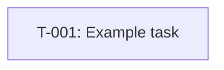

# TASK-PLAN v2

project:
plan_id:
plan_version:
canonical_source: TASK-PLAN.md
dashboard_target: TASK-DASHBOARD.html
status: draft
owner_role: planner
created_at:
updated_at:

## Feature Layer

feature_id:
feature_title:
rationale:
priority:
status:
goal:
scope_in:
- TBD
scope_out:
- TBD
changed_subsystems:
- TBD
constraints:
- TBD
assumptions:
- TBD
open_questions:
- TBD
risks:
- TBD
regression_risks:
- TBD
security_privacy_notes:
- TBD
non_functional_requirements:
- TBD
milestones:
- TBD
timebox:
wiki_pages_to_read_before:
- TBD
wiki_pages_to_update_after:
- TBD
wiki_facts_to_capture:
- TBD
wiki_do_not_store:
- secrets
- personal data

## Pre-Implementation Gate

feature_preparation_path: FEATURE-PREPARATION.md
preimplementation_status: draft
entry_rule: No implementation task may move to ready until the feature-preparation gate is complete.

## Execution Policy

orchestration_mode: sequential_multi_agent
default_agent_sequence:
- planner
- implementer
- reviewer
- tester
- docs_sync
status_legend:
- draft
- ready
- in_progress
- blocked
- needs_review
- approved
- done
- dropped

## Execution Governance

mode: CODE-FIRST, NO-FICTION, ONE-TASK-ONLY
no_fiction_policy:
- if required input is missing, return INVALID_INPUT instead of guessing
- do not invent files, commits, test results, approvals, blockers, or artifact paths
- use unknown only for non-critical fields
- critical unknowns block ready, in_progress, approved, and done
placeholder_policy:
- TBD is allowed only while task status is draft
- ready or in_progress is forbidden if critical fields are TBD
- placeholder evidence is forbidden
- placeholder tests are forbidden
- placeholder artifact paths are forbidden
prompt_policy:
- one task equals one prompt
- prompt must exist before in_progress
- prompt must include RESUME_FROM
- prompt must include scope_in, scope_out, forbidden_areas, and verification_strategy
code_first_policy:
- implementation tasks require code progress before docs-sync closure
- docs-only closure is allowed only for docs-governance tasks
- planning-only work cannot close implementation tasks
done_policy:
- dependencies are done or explicitly accepted as pending external dependency
- required approvals passed
- verification_strategy executed
- commands_run recorded
- test_artifacts recorded when tests_required is yes
- review_artifacts recorded
- rollback_plan exists
- Task Register and Task Block are synchronized
- no forbidden_areas touched
commit_policy:
- implementation tasks require implementation evidence
- docs sync is separate from implementation evidence
- commit hashes must be verified with rev-parse
- commit hashes must be reachable from HEAD
- full SHA belongs in evidence; short SHA belongs in register columns if used
sync_audit_policy:
- Task Register status must match Task Block status
- owner_role must match active execution state
- dependencies and unblocks must be bidirectional
- dashboard events must not contradict TASK-PLAN.md
boundary_audit_policy:
- forbidden_areas must be checked before done
- changes outside scope require reviewer approval
- scope violation moves task to needs_review or blocked
rollback_policy:
- failed required checks cannot go to done
- choose REVERT or FORWARD_FIX
- reopened tasks require updated prompt and new RESUME_FROM
- direct reopened to done is forbidden
timeout_escalation_policy:
- in_progress over timebox requires escalation
- max_review_loops exceeded requires escalation
- blocked_by must be explicit

## Verification Policy

verification_planning_rule:
- planner defines verification_strategy before implementer starts
- reviewer validates verification_strategy before code-review approval
- tester executes planned checks and records commands_run plus test_artifacts
- implementer must not silently weaken planned tests after coding
critical_verification_fields:
- tests_required
- test_levels
- test_targets
- test_data_origin
- oracle
- stop_on_failure
- commands_planned
test_level_enum:
- unit
- integration
- e2e
- smoke
- manual-check-needed
planned_vs_executed_rule:
- commands_planned is filled before implementation
- commands_run is filled only after actual execution
- commands_run must not be copied from commands_planned unless the command was actually run
failure_rule:
- if stop_on_failure is true, the task cannot pass to docs_sync after a required red test
- failed tests require blocked, reopened, revert, or forward-fix state

## Task Register

| task_id | title | status | priority | owner_role | depends_on | required_approvals |
| --- | --- | --- | --- | --- | --- | --- |
| T-001 | Example task | draft | P1 | planner | [] | [design-review, code-review] |

## Tasks

### TASK T-001

task_id: T-001
title:
rationale:
priority: P1
status: draft
owner_role: planner
agent_sequence:
- planner
- implementer
- reviewer
- tester
- docs_sync
agent_contracts:
- A1
- A2
- A3
- A4
- A5
required_approvals:
- design-review
- code-review
- qa-signoff
max_review_loops: 2
escalation_rule:
- if review loops exceed max_review_loops, escalate to project owner or tech lead
- if a blocker changes scope, send the task back to planner
dependencies:
- TBD
blocked_by:
- TBD
unblocks:
- TBD
task_size: M
decomposition_rule:
- split the task if it touches 3+ subsystems or mixes product and infra changes
milestones:
- TBD
timebox:
goal:
scope_in:
- TBD
scope_out:
- TBD
changed_subsystems:
- TBD
candidate_files:
- TBD
forbidden_areas:
- TBD
constraints:
- TBD
assumptions:
- TBD
open_questions:
- TBD
risks:
- TBD
regression_risks:
- TBD
security_privacy_notes:
- TBD
non_functional_requirements:
- TBD

#### Verification Strategy

tests_required: yes
test_levels:
- unit
- integration
test_targets:
- TBD
test_data_origin:
- synthetic
fixtures:
- TBD
oracle:
- TBD
negative_tests:
- TBD
determinism_notes:
- TBD
flakiness_risk:
- TBD
stop_on_failure: true
commands_planned:
- TBD
commands_run:
- TBD

#### Evidence and Closure

expected_artifacts:
- updated code
- test evidence
- review notes
code_artifacts:
- TBD
test_artifacts:
- TBD
review_artifacts:
- TBD
artifact_locations:
- TBD
acceptance_criteria:
- TBD
acceptance_checks:
- TBD
exit_criteria:
- code merged or locally validated
- required approvals collected
- required artifacts stored
rollback_plan:
- revert the code change
- disable the feature flag if present
observability:
- TBD
decision_log:
- [YYYY-MM-DD] Initial task created
summary_format:
- changed files
- checks run
- blockers
- next owner

#### Agent Contracts

##### A1
agent_id: A1
role: planner
entry_criteria:
- feature-preparation gate is complete
- dependencies are understood
input_artifacts:
- FEATURE-PREPARATION.md
- TASK-PLAN.md
steps:
- refine scope
- freeze candidate files
- resolve open questions or mark blockers
output_artifacts:
- updated task block
- planner handoff note
handoff_to: A2
approval_gate:
- design-review
stop_conditions:
- missing dependency
- unresolved scope conflict

##### A2
agent_id: A2
role: implementer
entry_criteria:
- planner handoff complete
- candidate files frozen
input_artifacts:
- updated task block
- planner handoff note
steps:
- implement the scoped change
- keep within allowed files
- record code artifacts
output_artifacts:
- code diff
- implementation notes
handoff_to: A3
approval_gate:
- code-review
stop_conditions:
- scope break
- blocked environment

##### A3
agent_id: A3
role: reviewer
entry_criteria:
- implementation diff exists
input_artifacts:
- code diff
- implementation notes
steps:
- review correctness and boundary adherence
- request correction or approve
output_artifacts:
- review notes
- approval or correction request
handoff_to: A4
approval_gate:
- code-review
stop_conditions:
- review loop exhausted

##### A4
agent_id: A4
role: tester
entry_criteria:
- review approved or conditionally approved
input_artifacts:
- code diff
- review notes
steps:
- execute required checks
- record failures and evidence
output_artifacts:
- test report
- logs or screenshots
handoff_to: A5
approval_gate:
- qa-signoff
stop_conditions:
- required test failure
- missing test data

##### A5
agent_id: A5
role: docs_sync
entry_criteria:
- tests passed or accepted per policy
input_artifacts:
- test report
- final decision
steps:
- sync docs or wiki targets
- close the task record
output_artifacts:
- updated docs
- final summary
handoff_to:
approval_gate:
- completion-signoff
stop_conditions:
- wiki target unresolved

## Dependency Graph

